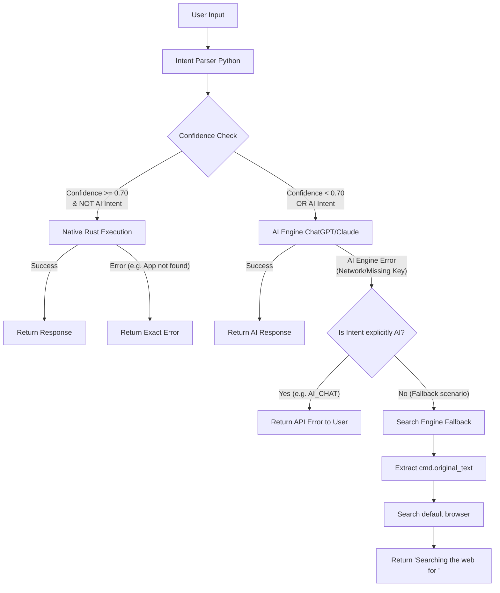

# Hyde Agent v2.1 Routing Architecture & Rules

This document outlines the strict execution hierarchy for the Hyde Agent V2 Router. This pipeline guarantees that explicit commands are executed quickly, AI is leveraged seamlessly for generation, and failures default gracefully.

## Execution Flow Diagram

## The 8-Tier Routing Priority

The router enforces the following priority order, ensuring `WEB_SEARCH` is the absolute last resort.

1. **OPEN_URL** (Fastest execution via `open::that`)
2. **OPEN_APP** (Native Windows search via `app::launch`)
3. **SYSTEM_COMMAND** (Rust native control for volume/power)
4. **TIMER / REMINDER** (Persistent SQLite DB insert)
5. **FILE_OPERATION** (File explorer invocation)
6. **AI_CHAT / AI_TASK** (Heavy computation via LLM API)
7. **SPECIFIC_SEARCH** (YouTube, GitHub, Reddit)
8. **WEB_SEARCH** (The ultimate fallback for unrecognized queries)

## Domain Detection Rules
The NLU engine will automatically map the following Top-Level Domains (TLDs) directly to **OPEN_URL**:
- `.com`
- `.net`
- `.org`
- `.io`
- `.dev`
- `.app`
- `.ai`
- `.co`
- `.in`

*Example:* `open thenn.in` -> `OPEN_URL` -> Executed natively.

## Error Handling Philosophy
1. **OS Failure Visibility**: If an OS-level command fails (e.g., trying to open an uninstalled app), the router **will not** fall back to web search. It returns the exact error string (e.g. *"I couldn't find 'fakeapp' installed on this system."*)
2. **AI Failure Visibility**: If the user explicitly asks an AI task (e.g. "tell me a joke") and the API key is missing, the router **will not** search the web for "tell me a joke". It returns the exact error string (e.g. *"AI Engine Error: API Key missing"*).
3. **Silent Search Fallback**: Web search is reserved **strictly** for intents that genuinely parse as `WEB_SEARCH`, or inputs that completely fail classification (Confidence < 0.50) without matching a specific intent.
